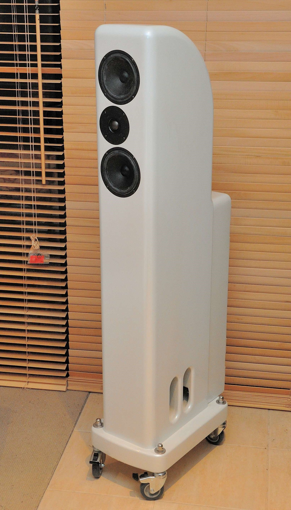

# Ariel Speakers

The Ariel speaker is a transmission line speaker based around the Scan-Speak D2905/9x00 drivers. 
This project is based off the [Nutshell Ariel 6c](http://nutshellhifi.com/Ariel.html) designed with laser cutters and CNC routers in mind.
All speaker dimensions are now [metric](Metric_2019.png).

[Click here for build information and construction details](https://daxprojects.wordpress.com/portfolio/ariel-speakers/).

## Folders

| Name | Description |
| - | - |
| Drafix CAD | The original CAD files for the speaker and crossover (XO) boxes. |
| Exported | The exported PDF, DXF and other files used for visualisation and building. |

### Images

